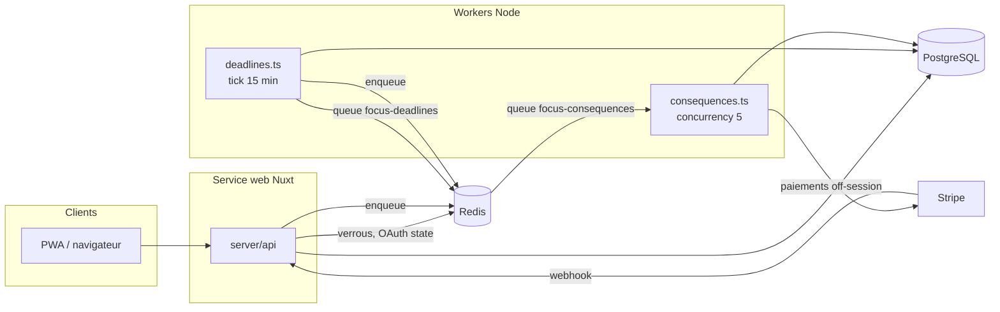
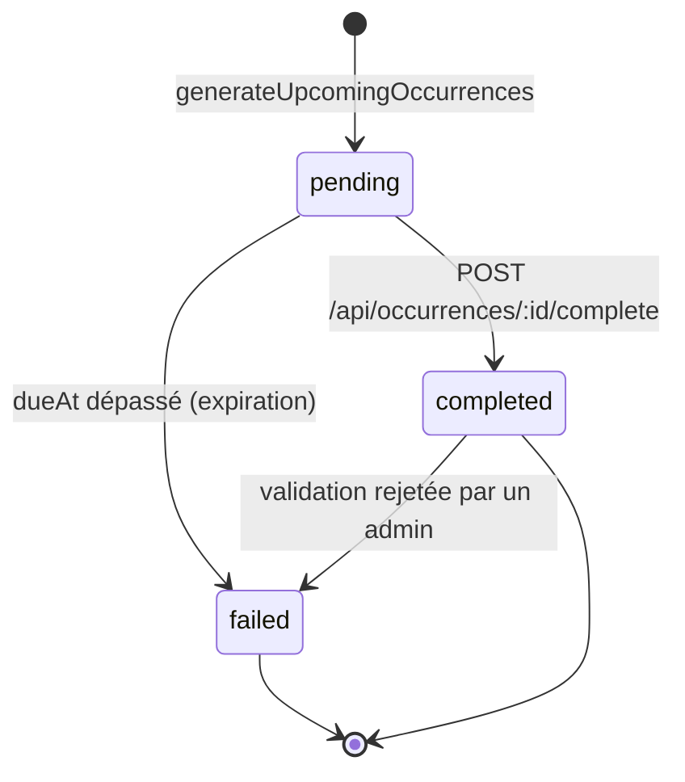
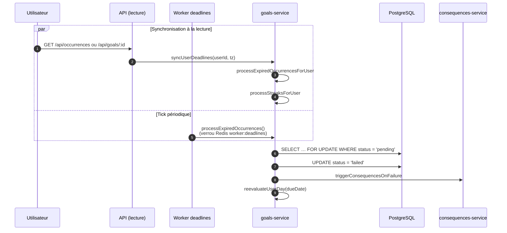
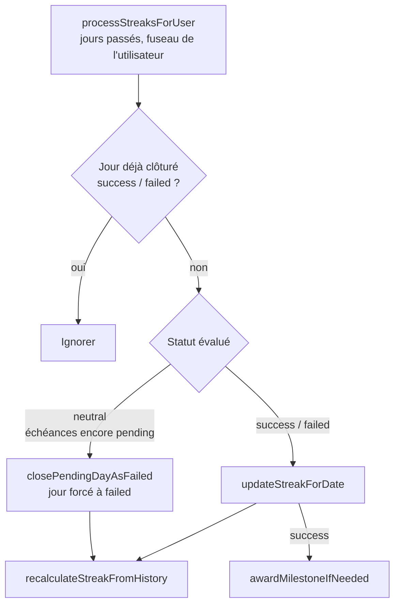
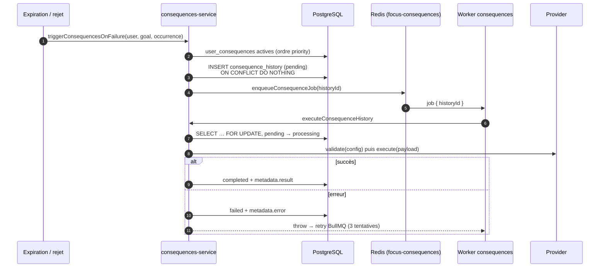

# Architecture de Focus

Ce document décrit le flux métier de Focus pour les nouveaux contributeurs : comment une échéance naît, expire, déclenche des conséquences et alimente le streak. Pour chaque notion, il pointe vers les fichiers de référence plutôt que de recopier le code.

- [Vue d’ensemble](#vue-densemble)
- [Cycle de vie d’une échéance](#cycle-de-vie-dune-échéance)
- [Workers BullMQ](#workers-bullmq)
- [Expiration des échéances](#expiration-des-échéances)
- [Streak et clôture journalière](#streak-et-clôture-journalière)
- [Pipeline des conséquences](#pipeline-des-conséquences)
- [Design tokens `app-*` vs `focus-*`](#design-tokens-app--vs-focus-)

## Vue d’ensemble

Focus tourne sous la forme de trois processus qui partagent la même base PostgreSQL et le même Redis :

| Processus | Commande | Rôle |
|---|---|---|
| **web** | `pnpm dev` / `node .output/server/index.mjs` | App Nuxt (pages + API `server/api`) |
| **worker** | `pnpm worker` → `server/workers/deadlines.ts` | Tick toutes les 15 min : expiration, génération des échéances, streaks, classement |
| **consequences** | `pnpm worker:consequences` → `server/workers/consequences.ts` | Exécute les conséquences mises en file d’attente |

Les files BullMQ (`focus-deadlines`, `focus-consequences`) vivent dans Redis. Sans le worker `consequences`, les conséquences restent en statut `pending` en base. Elles sont reprises au démarrage suivant du worker (voir [Reprise](#idempotence-et-reprise)).

## Cycle de vie d’une échéance

Un **objectif** (`goals`) produit des **échéances** (`occurrences`), une par date à tenir. Chaque échéance porte une `dueDate` (jour local de l’utilisateur) et un `dueAt` (instant UTC limite).

- Le statut `skipped` existe dans l’enum `occurrence_status` et il est ignoré dans le calcul du streak, mais aucun code ne l’attribue pour l’instant.
- **Génération** : `generateUpcomingOccurrences` (`server/utils/goals-service.ts`) crée les échéances des 30 prochains jours pour chaque objectif actif, dans le fuseau de l’utilisateur. Les dates viennent de `server/utils/occurrences.ts` (`generateOccurrenceDates`, ou `generateMilestoneOccurrences` pour les objectifs de type `project`). L’index unique `(goal_id, due_date, milestone_id)` et `onConflictDoNothing` rendent l’opération ré-exécutable.
- **Réussite** : `server/api/occurrences/[id]/complete.post.ts` passe l’échéance en `completed`, crée une `validation` en `pending_review`, crédite `rewardCredits` et recalcule le jour courant du streak. Si une [preuve obligatoire](#providers) est en attente, la requête est refusée sans preuve.
- **Modération** : `server/api/admin/validations/[id]/review.post.ts`. Un rejet repasse l’échéance en `failed`, déclenche les conséquences et réévalue le jour. Les crédits gagnés à la validation ne sont pas repris.

## Workers BullMQ

### `deadlines` (`server/workers/deadlines.ts`)

Un job répétable `tick` est planifié toutes les 15 minutes dans la file `focus-deadlines`, et un tick est aussi exécuté immédiatement au démarrage. Chaque tick enchaîne :

1. `processExpiredOccurrences()` : [expiration](#expiration-des-échéances) globale
2. `generateUpcomingOccurrences()` : fenêtre glissante de 30 jours
3. `processStreaksAfterExpiration()` : [clôture des jours passés](#streak-et-clôture-journalière) pour tous les utilisateurs non bloqués
4. `runLeaderboardJobs()` : snapshot quotidien du classement, et le lundi, `settlePreviousWeekRewards()` (bonus du top de la semaine écoulée), voir `server/utils/leaderboard.ts`

Une erreur dans un tick est journalisée mais ne fait pas échouer le job : le tick suivant repasse sur les mêmes données.

### `consequences` (`server/workers/consequences.ts`)

Consomme la file `focus-consequences` (concurrence 5). Chaque job porte un `historyId` et appelle `executeConsequenceHistory`. La mise en file se fait dans `server/utils/consequences-queue.ts` : `jobId = historyId` (pas de doublon), 3 tentatives avec backoff exponentiel.

## Expiration des échéances

Une échéance `pending` dont le `dueAt` est passé doit devenir `failed`. Cela arrive par **deux chemins** qui partagent le même code (`markExpiredOccurrencesAsFailed` dans `server/utils/goals-service.ts`) :

- **Tick** (`processExpiredOccurrences`) : traite toutes les échéances expirées, sous un verrou Redis `lock:worker:deadlines` (TTL 60 s) pour éviter que deux workers tournent en parallèle. Si le verrou n’est pas acquis, le tick est ignoré.
- **Lecture API** (`syncUserDeadlines`) : `GET /api/occurrences` et `GET /api/goals/:id` traitent les échéances expirées **de l’utilisateur courant** avant de répondre, pour que l’UI soit juste même si le worker est en retard ou arrêté. Les erreurs sont avalées : la lecture ne doit jamais échouer à cause de la synchronisation. L’issue #9 propose d’en limiter la fréquence.
- **Concurrence** : chaque échéance est reverrouillée (`FOR UPDATE`) et son statut revérifié dans une transaction. Si les deux chemins tombent sur la même échéance, un seul la passe en `failed` et déclenche les conséquences.

## Streak et clôture journalière

Code : `server/utils/streaks.ts`. Le streak compte les **jours parfaits consécutifs**, c’est-à-dire les jours où toutes les échéances non `skipped` sont `completed`.

### Évaluer un jour

`evaluateDayFromStatuses` calcule le statut d’un jour à partir de ses échéances :

| Échéances du jour | Statut |
|---|---|
| aucune | `neutral` |
| au moins une `failed` | `failed` |
| au moins une `pending` | `neutral` (jour encore ouvert) |
| toutes `completed` | `success` |

Le résultat est stocké dans `user_daily_results` (une ligne par utilisateur et par jour, en upsert).

### Recalcul du streak

Le streak n’est jamais incrémenté à la main : `recalculateStreakFromHistory` le **recalcule entièrement** à partir de `user_daily_results`. Si le dernier jour clôturé est `failed`, le streak courant retombe à 0. Sinon, il vaut la longueur de la dernière suite de jours `success` consécutifs. `longestStreak` ne diminue jamais. Perdre son streak n’est donc pas une conséquence à part : c’est l’effet mécanique d’un jour `failed`.

Tous les 7 jours de streak (`STREAK_MILESTONE_DAYS`), `awardMilestoneIfNeeded` verse 10 crédits (`STREAK_MILESTONE_REWARD`) une seule fois par palier (table `streak_rewards`).

### Clôture des jours passés

Déclencheurs :

- **Worker** : `processStreaksAfterExpiration` à chaque tick, pour tous les utilisateurs.
- **Lecture API** : via `syncUserDeadlines`, pour l’utilisateur courant.
- **Réussite** : `syncTodayStreak` après chaque `complete`. La réponse contient le streak seulement si la journée devient parfaite, ce qui déclenche l’animation côté client.
- **Échec** : `reevaluateUserDay` après chaque expiration ou rejet de validation.

Toutes les dates « jour » sont calculées dans le fuseau de l’utilisateur (`users.timezone`, via `getTodayInTimezone`).

## Pipeline des conséquences

Chaque utilisateur configure une liste ordonnée de conséquences (`user_consequences`, champ `priority`). Quand une échéance passe en `failed`, **toutes les conséquences actives** sont déclenchées.

### Providers

Un provider implémente `ConsequenceProvider` (`server/consequences/types.ts`) : `validate` (schéma zod de la config), `estimate` (libellé affiché à l’utilisateur) et `execute`. Ils sont enregistrés dans `server/consequences/registry.ts`.

| Clé | Fichier | Effet | Montant |
|---|---|---|---|
| `credits` | `providers/credits.ts` | Retire des crédits via `applyPenalty`. Si le solde est insuffisant, le reste passe en dette. | crédits (≥ 1) |
| `random-user` | `providers/random-user.ts` | Transfère des crédits à un utilisateur tiré au hasard dont le score net est ≥ `minimumScore` | crédits (≥ 1) |
| `stripe` | `providers/stripe.ts` | Prélèvement off-session sur la carte enregistrée | centimes (≥ 100) |
| `donation` | `providers/donation.ts` | Prélèvement Stripe, puis cumul dans la cagnotte de l’association choisie (`donation_executions`). Un admin reverse ensuite la cagnotte à l’association (`recordAssociationPayout`). | centimes (≥ 100) |
| `mandatory-proof` | `providers/mandatory-proof.ts` | Crée une `proof_requirement` : la prochaine réussite sur cet objectif exigera une preuve | — |
| `custom` | `providers/custom.ts` | Notification avec le message choisi par l’utilisateur | — |

Les providers monétaires passent par `chargeUserForConsequence` (`server/utils/consequence-payment.ts`) : ils échouent si Stripe n’est pas configuré sur le serveur ou si l’utilisateur n’a pas de moyen de paiement. Le webhook `server/api/stripe/webhook.post.ts` resynchronise ensuite le statut des paiements.

> **Historique** : `community-pot` (cagnotte globale) a été remplacé par les cagnottes par association. La clé existe encore dans `CONSEQUENCE_PROVIDER_KEYS` et le fichier `providers/community-pot.ts` est toujours là, mais le provider n’est plus enregistré, et le type est désactivé en base (migration `0007`). De même, `streak-reset` a été retiré (migration `0008`), car la perte du streak est automatique.

### Ajouter un provider

1. Ajouter la clé dans `CONSEQUENCE_PROVIDER_KEYS`, le schéma de config et l’entrée de `ProviderConfigMap` (`server/consequences/types.ts`). Classer la clé dans `isMonetaryProvider`, `isCreditsProvider` ou `isNonMonetaryBehaviorProvider` pour la validation du montant.
2. Créer `server/consequences/providers/<clé>.ts` et l’enregistrer dans `registry.ts`.
3. Ajouter une migration SQL qui insère la ligne dans `consequence_types` (nom, description, icône, `enabled`).
4. Rendre `execute` **idempotent** : un job peut être rejoué (voir ci-dessous).

### Idempotence et reprise

- `consequence_history` a un index unique `(occurrence_id, user_consequence_id)` : une même échéance ne déclenche chaque conséquence qu’une fois, même si expiration et rejet se chevauchent.
- `executeConsequenceHistory` verrouille la ligne et ne l’exécute que si elle n’est ni `processing`, ni `completed`, ni `cancelled`.
- Au démarrage, le worker ré-enfile toutes les lignes `pending` (`recoverPendingConsequenceJobs`), par exemple si Redis a été vidé ou si le worker était arrêté.
- Les effets de bord portent eux aussi des contraintes uniques, par exemple `donation_executions.consequence_history_id`.

## Design tokens `app-*` vs `focus-*`

Deux familles de tokens cohabitent dans `tailwind.config.ts` :

| Famille | Exemples | Utilisée par |
|---|---|---|
| `focus-*` | `focus-black`, `focus-gray-50…900`, `focus-accent`, `rounded-focus-lg`, `shadow-focus` | Landing et pages publiques (`layouts/default.vue`), panel admin (`layouts/admin.vue`, `pages/admin`), composants génériques `components/ui` (`UiButton`, `UiCard`…), classes de base de `app/assets/css/main.css` (`focus-container`, `focus-heading-*`) |
| `app-*` | `app-canvas`, `app-surface`, `app-ink`, `app-line`, `app-muted`, `rounded-app-card`, `shadow-app-nav` | Espace connecté mobile-first (`layouts/app.vue`, `pages/app/**`, `components/app/**`) |

La séparation est stricte aujourd’hui : `pages/app`, `components/app` et `layouts/app.vue` n’utilisent aucun token `focus-*` ni aucun composant `Ui*`. Règle pratique : un écran sous `/app` utilise les tokens `app-*` et ses propres composants de `components/app`, tout le reste utilise `focus-*` et `components/ui`. Évitez de mélanger les deux familles dans un même composant.
