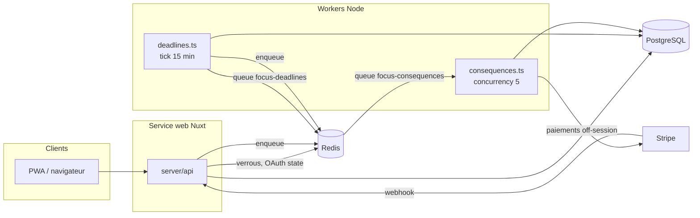
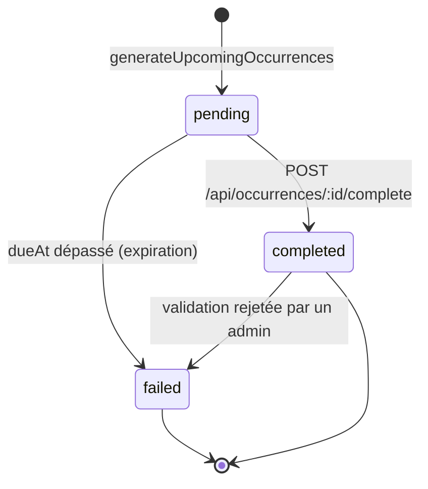
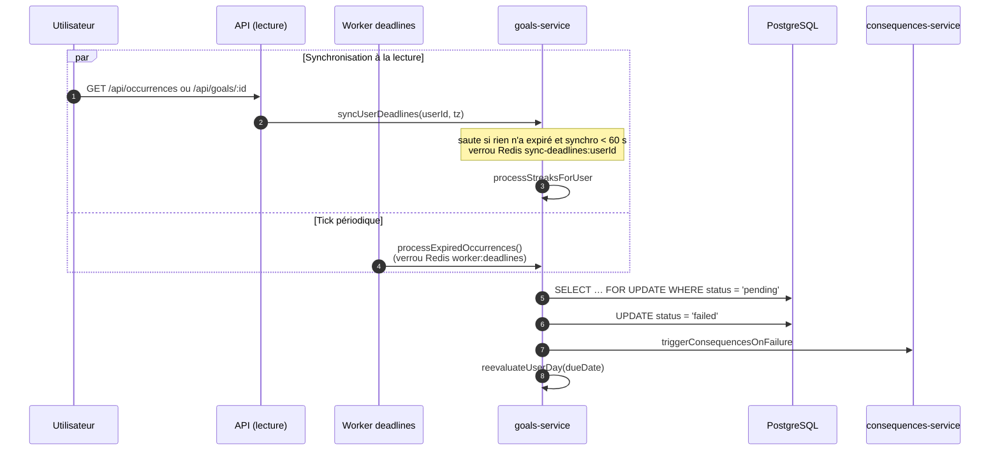
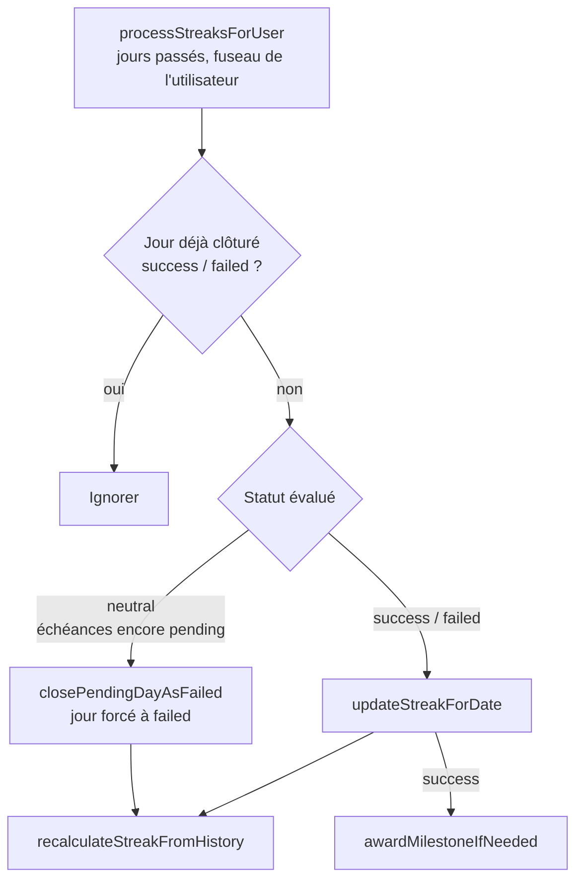
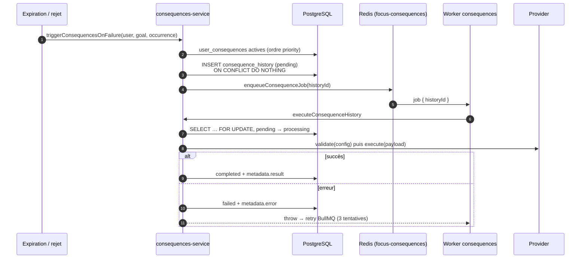
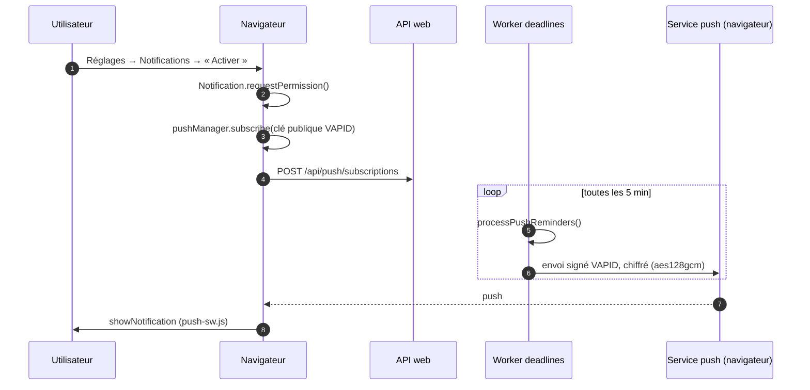

# Architecture de Focus

Pour installer une instance, voir [self-hosting.md](./self-hosting.md).

Ce document décrit le flux métier de Focus pour les nouveaux contributeurs : comment une échéance naît, expire, déclenche des conséquences et alimente le streak. Pour chaque notion, il pointe vers les fichiers de référence plutôt que de recopier le code.

- [Vue d’ensemble](#vue-densemble)
- [Cycle de vie d’une échéance](#cycle-de-vie-dune-échéance)
- [Workers BullMQ](#workers-bullmq)
- [Expiration des échéances](#expiration-des-échéances)
- [Streak et clôture journalière](#streak-et-clôture-journalière)
- [Mode pause / vacances](#mode-pause--vacances)
- [Pipeline des conséquences](#pipeline-des-conséquences)
- [Notifications push](#notifications-push)
- [Mode hors ligne (PWA)](#mode-hors-ligne-pwa)
- [Design tokens `app-*` vs `focus-*`](#design-tokens-app--vs-focus-)

## Vue d’ensemble

Focus tourne sous la forme de trois processus qui partagent la même base PostgreSQL et le même Redis :

| Processus | Commande | Rôle |
|---|---|---|
| **web** | `pnpm dev` / `node .output/server/index.mjs` | App Nuxt (pages + API `server/api`) |
| **worker** | `pnpm worker` → `server/workers/deadlines.ts` | Tick toutes les 15 min : expiration, génération des échéances, streaks, classement |
| **consequences** | `pnpm worker:consequences` → `server/workers/consequences.ts` | Exécute les conséquences mises en file d’attente |

Les files BullMQ (`focus-deadlines`, `focus-consequences`) vivent dans Redis. Sans le worker `consequences`, les conséquences restent en statut `pending` en base. Elles sont reprises au démarrage suivant du worker (voir [Reprise](#idempotence-et-reprise)).

## Cycle de vie d’une échéance

Un **objectif** (`goals`) produit des **échéances** (`occurrences`), une par date à tenir. Chaque échéance porte une `dueDate` (jour local de l’utilisateur) et un `dueAt` (instant UTC limite).

- Le statut `skipped` (« En pause ») est attribué par le [mode pause](#mode-pause--vacances). Une échéance `skipped` n’expire jamais : aucun échec, aucune conséquence.
- **Génération** : `generateUpcomingOccurrences` (`server/utils/goals-service.ts`) crée les échéances des 30 prochains jours pour chaque objectif actif, dans le fuseau de l’utilisateur. Les dates viennent de `server/utils/occurrences.ts` (`generateOccurrenceDates`, ou `generateMilestoneOccurrences` pour les objectifs de type `project`). L’index unique `(goal_id, due_date, milestone_id)` et `onConflictDoNothing` rendent l’opération ré-exécutable.
- **Réussite** : `server/api/occurrences/[id]/complete.post.ts` passe l’échéance en `completed`, crée une `validation` en `pending_review`, crédite `rewardCredits` et recalcule le jour courant du streak. Si une [preuve obligatoire](#providers) est en attente, la requête est refusée sans preuve.
- **Modération** : `server/api/admin/validations/[id]/review.post.ts`. Un rejet repasse l’échéance en `failed`, déclenche les conséquences et réévalue le jour. Les crédits gagnés à la validation ne sont pas repris.

## Workers BullMQ

### `deadlines` (`server/workers/deadlines.ts`)

Un job répétable `tick` est planifié toutes les 15 minutes dans la file `focus-deadlines`, et un tick est aussi exécuté immédiatement au démarrage. Chaque tick enchaîne :

1. `processExpiredOccurrences()` : [expiration](#expiration-des-échéances) globale
2. `generateUpcomingOccurrences()` : fenêtre glissante de 30 jours
3. `processStreaksAfterExpiration()` : [clôture des jours passés](#streak-et-clôture-journalière) pour tous les utilisateurs non bloqués
4. `runLeaderboardJobs()` : snapshot quotidien du classement, et le lundi, `settlePreviousWeekRewards()` (bonus du top de la semaine écoulée), voir `server/utils/leaderboard.ts`

Une erreur dans un tick est journalisée mais ne fait pas échouer le job : le tick suivant repasse sur les mêmes données.

### `consequences` (`server/workers/consequences.ts`)

Consomme la file `focus-consequences` (concurrence 5). Chaque job porte un `historyId` et appelle `executeConsequenceHistory`. La mise en file se fait dans `server/utils/consequences-queue.ts` : `jobId = historyId` (pas de doublon), 3 tentatives avec backoff exponentiel.

## Expiration des échéances

Une échéance `pending` dont le `dueAt` est passé doit devenir `failed`. Cela arrive par **deux chemins** qui partagent le même code (`markExpiredOccurrencesAsFailed` dans `server/utils/goals-service.ts`) :

- **Tick** (`processExpiredOccurrences`) : traite toutes les échéances expirées, sous un verrou Redis `lock:worker:deadlines` (TTL 60 s) pour éviter que deux workers tournent en parallèle. Si le verrou n’est pas acquis, le tick est ignoré.
- **Lecture API** (`syncUserDeadlines`) : `GET /api/occurrences` et `GET /api/goals/:id` traitent les échéances expirées **de l’utilisateur courant** avant de répondre, pour que l’UI soit juste même si le worker est en retard ou arrêté. Les erreurs sont avalées : la lecture ne doit jamais échouer à cause de la synchronisation. Pour limiter la charge :
  - s’il existe une échéance expirée, elle est **toujours** traitée tout de suite ;
  - sinon, la clôture des jours passés n’est rejouée qu’une fois par minute et par utilisateur (marqueur Redis `sync-deadlines:last:<userId>`, `SYNC_THROTTLE_SECONDS`) ;
  - un verrou Redis `lock:sync-deadlines:<userId>` empêche deux synchronisations concurrentes du même utilisateur : la seconde lecture répond sans synchroniser ;
  - si Redis est indisponible, la synchronisation a lieu quand même (voir « Concurrence »). Chaque opération Redis de ce chemin est bornée à 500 ms, car le client attend sinon indéfiniment la reconnexion.
- **Concurrence** : chaque échéance est reverrouillée (`FOR UPDATE`) et son statut revérifié dans une transaction. Si les deux chemins tombent sur la même échéance, un seul la passe en `failed` et déclenche les conséquences.

## Streak et clôture journalière

Code : `server/utils/streaks.ts`. Le streak compte les **jours parfaits consécutifs**, c’est-à-dire les jours où toutes les échéances non `skipped` sont `completed`.

### Évaluer un jour

`evaluateDayFromStatuses` calcule le statut d’un jour à partir de ses échéances :

| Échéances du jour | Statut |
|---|---|
| aucune | `neutral` |
| au moins une `failed` | `failed` |
| au moins une `pending` | `neutral` (jour encore ouvert) |
| toutes `completed` | `success` |

Le résultat est stocké dans `user_daily_results` (une ligne par utilisateur et par jour, en upsert).

### Recalcul du streak

Le streak n’est jamais incrémenté à la main : `recalculateStreakFromHistory` le **recalcule entièrement** à partir de `user_daily_results`. Si le dernier jour clôturé est `failed`, le streak courant retombe à 0. Sinon, il vaut la longueur de la dernière suite de jours `success` consécutifs, les jours de [pause](#mode-pause--vacances) étant gelés (ni rupture ni jour compté). `longestStreak` ne diminue jamais. Perdre son streak n’est donc pas une conséquence à part : c’est l’effet mécanique d’un jour `failed`.

Tous les 7 jours de streak (`STREAK_MILESTONE_DAYS`), `awardMilestoneIfNeeded` verse 10 crédits (`STREAK_MILESTONE_REWARD`) une seule fois par palier (table `streak_rewards`).

### Clôture des jours passés

Déclencheurs :

- **Worker** : `processStreaksAfterExpiration` à chaque tick, pour tous les utilisateurs.
- **Lecture API** : via `syncUserDeadlines`, pour l’utilisateur courant.
- **Réussite** : `syncTodayStreak` après chaque `complete`. La réponse contient le streak seulement si la journée devient parfaite, ce qui déclenche l’animation côté client.
- **Échec** : `reevaluateUserDay` après chaque expiration ou rejet de validation.

Toutes les dates « jour » sont calculées dans le fuseau de l’utilisateur (`users.timezone`, via `getTodayInTimezone`).

## Mode pause / vacances

Code : `server/utils/pauses.ts`, `server/api/pauses/*`, page `app/pages/app/reglages/pause.vue`. Table `pause_periods` : dates locales de l’utilisateur, bornes incluses.

- **Règles** : une pause commence au plus tôt aujourd’hui (pas de pause rétroactive, pour ne pas effacer un échec déjà constaté), dure au plus `MAX_PAUSE_DAYS` (60) jours, et ne chevauche pas une autre pause.
- **Échéances** : à la création, les échéances `pending` de la période passent en `skipped`. Celles générées ensuite sur la période (`generateUpcomingOccurrences`) naissent directement `skipped`. Comme seules les échéances `pending` expirent, **aucun échec, aucune conséquence, aucun rappel push** ne peut survenir pendant la pause.
- **Fin anticipée** : une pause à venir, ou commencée le jour même, est annulée (`cancelled_at`). Une pause commencée avant aujourd’hui est terminée à la veille (`end_date`), et la date prévue est conservée dans `original_end_date` pour l’historique. Dans les deux cas, les échéances `skipped` dont l’heure limite n’est pas passée redeviennent `pending`.
- **Streak gelé** : les jours de pause sont transparents pour la consécutivité (`isConsecutiveDay`). Deux jours réussis séparés uniquement par des jours de pause restent consécutifs, et les jours de pause ne s’ajoutent pas au compte. Exemple : réussi lun. et mar., pause mer.–ven., réussi sam. et dim. → streak de **4**, pas de 7, et pas de remise à zéro. Un jour non gelé manqué, ou un échec après la pause, casse toujours le streak.
- **Visibilité** : bannière dans l’espace connecté pendant une pause (`/api/auth/me` renvoie `activePause`), statut « En pause » sur les échéances, historique des pauses (à venir, en cours, terminée, annulée) dans Réglages → Pause / vacances.

## Pipeline des conséquences

Chaque utilisateur configure une liste ordonnée de conséquences (`user_consequences`, champ `priority`). Quand une échéance passe en `failed`, **toutes les conséquences actives** sont déclenchées.

### Providers

Un provider implémente `ConsequenceProvider` (`server/consequences/types.ts`) : `validate` (schéma zod de la config), `estimate` (libellé affiché à l’utilisateur) et `execute`. Ils sont enregistrés dans `server/consequences/registry.ts`.

| Clé | Fichier | Effet | Montant |
|---|---|---|---|
| `credits` | `providers/credits.ts` | Retire des crédits via `applyPenalty`. Si le solde est insuffisant, le reste passe en dette. | crédits (≥ 1) |
| `random-user` | `providers/random-user.ts` | Transfère des crédits à un utilisateur tiré au hasard dont le score net est ≥ `minimumScore` | crédits (≥ 1) |
| `stripe` | `providers/stripe.ts` | Prélèvement off-session sur la carte enregistrée | centimes (≥ 100) |
| `donation` | `providers/donation.ts` | Prélèvement Stripe, puis cumul dans la cagnotte de l’association choisie (`donation_executions`). Un admin reverse ensuite la cagnotte à l’association (`recordAssociationPayout`). | centimes (≥ 100) |
| `mandatory-proof` | `providers/mandatory-proof.ts` | Crée une `proof_requirement` : la prochaine réussite sur cet objectif exigera une preuve | — |
| `custom` | `providers/custom.ts` | Notification avec le message choisi par l’utilisateur | — |

Les providers monétaires passent par `chargeUserForConsequence` (`server/utils/consequence-payment.ts`) : ils échouent si Stripe n’est pas configuré sur le serveur ou si l’utilisateur n’a pas de moyen de paiement. Le webhook `server/api/stripe/webhook.post.ts` resynchronise ensuite le statut des paiements.

> **Historique** : `community-pot` (cagnotte globale) a été remplacé par les cagnottes par association. La clé existe encore dans `CONSEQUENCE_PROVIDER_KEYS` et le fichier `providers/community-pot.ts` est toujours là, mais le provider n’est plus enregistré, et le type est désactivé en base (migration `0007`). De même, `streak-reset` a été retiré (migration `0008`), car la perte du streak est automatique.

### Ajouter un provider

1. Ajouter la clé dans `CONSEQUENCE_PROVIDER_KEYS`, le schéma de config et l’entrée de `ProviderConfigMap` (`server/consequences/types.ts`). Classer la clé dans `isMonetaryProvider`, `isCreditsProvider` ou `isNonMonetaryBehaviorProvider` pour la validation du montant.
2. Créer `server/consequences/providers/<clé>.ts` et l’enregistrer dans `registry.ts`.
3. Ajouter une migration SQL qui insère la ligne dans `consequence_types` (nom, description, icône, `enabled`).
4. Rendre `execute` **idempotent** : un job peut être rejoué (voir ci-dessous).

### Idempotence et reprise

- `consequence_history` a un index unique `(occurrence_id, user_consequence_id)` : une même échéance ne déclenche chaque conséquence qu’une fois, même si expiration et rejet se chevauchent.
- `executeConsequenceHistory` verrouille la ligne et ne l’exécute que si elle n’est ni `processing`, ni `completed`, ni `cancelled`.
- Au démarrage, le worker ré-enfile toutes les lignes `pending` (`recoverPendingConsequenceJobs`), par exemple si Redis a été vidé ou si le worker était arrêté.
- Les effets de bord portent eux aussi des contraintes uniques, par exemple `donation_executions.consequence_history_id`.

## Notifications push

Code : `server/utils/push.ts` (envoi, préférences, rappels), `server/api/push/*`, `app/composables/usePushNotifications.ts`, `public/push-sw.js` (importé par le service worker Workbox).

| Type | Déclencheur | Clé de déduplication |
|---|---|---|
| `due_reminder` | Job du worker `deadlines`, toutes les 5 min : échéance `pending` dont `dueAt` tombe dans le délai choisi (15 min à 4 h) | id de l’échéance |
| `streak_at_risk` | Même job : à partir de 20 h (heure locale), streak > 0 et échéances du jour encore à valider | date locale |
| `consequence_executed` | `executeConsequenceHistory`, après une exécution réussie | id de l’historique |
| `milestone_bonus` | `awardMilestoneIfNeeded`, quand un bonus de palier est versé | palier |

- **Consentement** : aucun envoi sans ligne dans `push_subscriptions`, créée seulement après le clic de l’utilisateur et l’autorisation du navigateur. À la déconnexion, l’appareil est désabonné (navigateur et serveur).
- **Préférences** (`notification_preferences`) : un booléen par type, le délai du rappel et la langue des messages (`fr` / `en`, enregistrée à l’abonnement).
- **Une seule fois** : `push_deliveries` porte une contrainte unique `(user_id, kind, ref_key)`. Si aucun appareil n’a pu être joint, la ligne est supprimée pour réessayer au passage suivant.
- **Abonnements expirés** : une réponse 404 ou 410 du service push supprime l’abonnement.
- **Isolation des erreurs** : les envois déclenchés par un flux métier passent par `notifySafely`, qui ne fait jamais échouer la conséquence ou le bonus.
- **Clés VAPID** lues au lancement (`process.env`), pour que les workers, qui s’exécutent hors de Nuxt, les reçoivent aussi.

## Mode hors ligne (PWA)

Le service worker est généré par `@vite-pwa/nuxt` (config `pwa.workbox` dans `nuxt.config.ts`). Les pages `/app` étant rendues côté serveur, il n’y a pas de coquille d’application à précacher : l’app met en cache ce que l’utilisateur a **déjà consulté**.

| Requête | Stratégie | Cache |
|---|---|---|
| Assets (`js`, `css`, icônes), `/`, `/offline` | Précache | `workbox-precache-*` |
| Navigation vers `/app/**` | NetworkFirst, puis `/offline` si la page n’a jamais été consultée | `focus-pages` |
| `GET /api/auth/me`, `/api/occurrences`, `/api/streak`, `/api/goals` | NetworkFirst (réponses 200 uniquement) | `focus-api` |

- **Données personnelles** : `focus-pages` et `focus-api` sont vidés à la connexion, à l’inscription et à la déconnexion (`app/utils/offline-cache.ts`), pour qu’un appareil partagé ne montre jamais les données d’un autre compte.
- **Session** : `fetchUser` ne déconnecte que sur une réponse explicite du serveur (401…) ; une erreur réseau conserve l’utilisateur connu.
- **Écritures** : aucune file d’attente. La validation d’une échéance est désactivée hors ligne (bannière `AppOfflineBanner` + message dans la modale), et la mutation utilise `networkMode: 'always'` pour échouer tout de suite plutôt que d’être rejouée à l’insu de l’utilisateur à la reconnexion.
- **Précache et URLs** : `@vite-pwa/nuxt` réécrit `x.html` en `/x` dans le manifeste de précache. Une page statique doit donc être placée en `public/<nom>/index.html` pour être servie à l’URL précachée, sinon l’installation du service worker échoue (404).

## Design tokens `app-*` vs `focus-*`

Deux familles de tokens cohabitent dans `tailwind.config.ts` :

| Famille | Exemples | Utilisée par |
|---|---|---|
| `focus-*` | `focus-black`, `focus-gray-50…900`, `focus-accent`, `rounded-focus-lg`, `shadow-focus` | Landing et pages publiques (`layouts/default.vue`), panel admin (`layouts/admin.vue`, `pages/admin`), composants génériques `components/ui` (`UiButton`, `UiCard`…), classes de base de `app/assets/css/main.css` (`focus-container`, `focus-heading-*`) |
| `app-*` | `app-canvas`, `app-surface`, `app-ink`, `app-line`, `app-muted`, `rounded-app-card`, `shadow-app-nav` | Espace connecté mobile-first (`layouts/app.vue`, `pages/app/**`, `components/app/**`) |

La séparation est stricte aujourd’hui : `pages/app`, `components/app` et `layouts/app.vue` n’utilisent aucun token `focus-*` ni aucun composant `Ui*`. Règle pratique : un écran sous `/app` utilise les tokens `app-*` et ses propres composants de `components/app`, tout le reste utilise `focus-*` et `components/ui`. Évitez de mélanger les deux familles dans un même composant.
